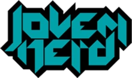

<h1 align="center"> Recriação do site Jovem Nerd </h1>

Projeto proposto na aula de programação web

  <a href="#-tecnologias">Tecnologias</a>&nbsp;&nbsp;&nbsp;|&nbsp;&nbsp;&nbsp;
  <a href="#-Funções">Funções</a>&nbsp;&nbsp;&nbsp;|&nbsp;&nbsp;&nbsp;
  <a href="#-projeto">Projeto</a>&nbsp;&nbsp;&nbsp;|&nbsp;&nbsp;&nbsp;
  <a href="#-layout">Layout</a>

 

  

## 🚀 Tecnologias

Esse projeto foi desenvolvido com as seguintes tecnologias:

- HTML e CSS
- JavaScript vanilla

## ⚙ Funções

- Responsivo
- Flex-box
- Dark mode

## 💻 Projeto

  

Projeto desenvolvido para o trabalho de programação web. O objetivo desse trabalho era recriar o layout do site de notícias Jovem Nerd e depois criar um site utilizando apenas HTML, CSS e JS.

## 🔖 Layout

Você pode visualizar o layout do projeto através [DESSE LINK](https://www.figma.com/file/IC9tmpd1gmTwrmyjhVPzER/jovemNerd/duplicate). É necessário ter conta no [Figma](https://figma.com) para acessá-lo.

---

Feito com ♥ by Romullo - rom013
